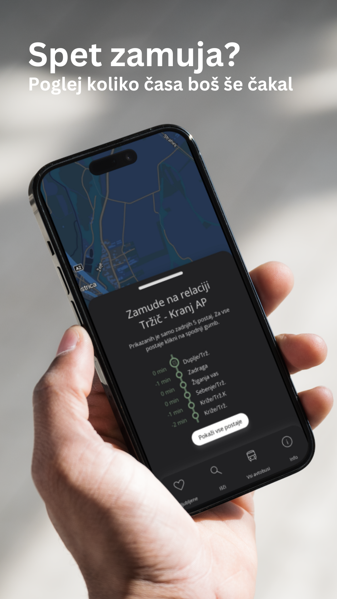
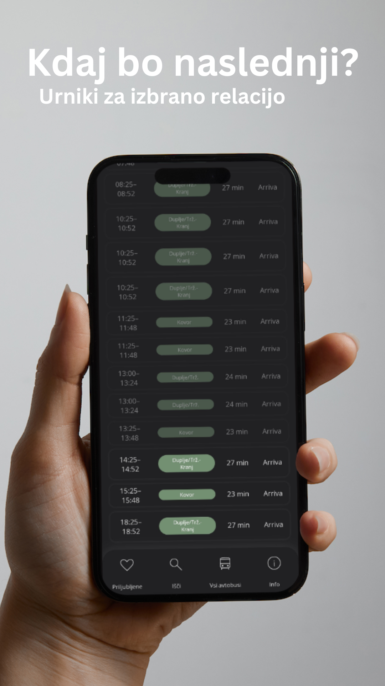
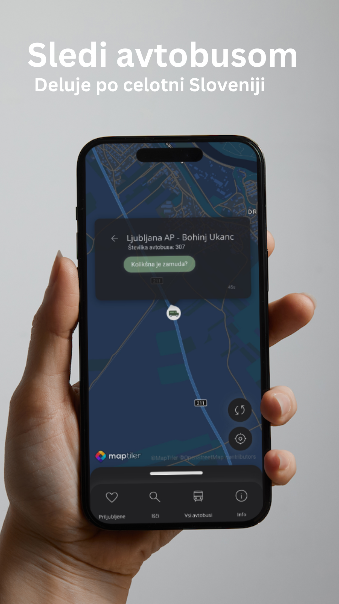

# Busi 
## Prikazovalnik avtobusov in njihovih zamud.  
<!--    -->

Spletna aplikacija [Busi](https://zznidar.github.io/busi/) omogoča pregled nad vsemi slovenskimi avtobusi znotraj IJPP. Uporabniku so prikazane naslednje informacije:  
* **zamude** posameznih avtobusov
* real-time **napovedi prihodov**
* zemljevid s potjo posameznega avtobusa
* **lokacije** vseh avtobusov  

  

## Vir podatkov
Podatki o avtobusih se pridobivajo od projekta [OJPP](https://ojpp.si).
